# 👒마리팜 My Little Farm


나만의 작은 텃밭을 기르는 도시 농부들을 위한 큐레이팅 SNS 서비스

## 📙 Duration <br>
2023.01.09 ~ 2023.02.17 <br>

## ✨ Features

### 베란다 텃밭을 위한 각종 정보 제공 및 작물 추천
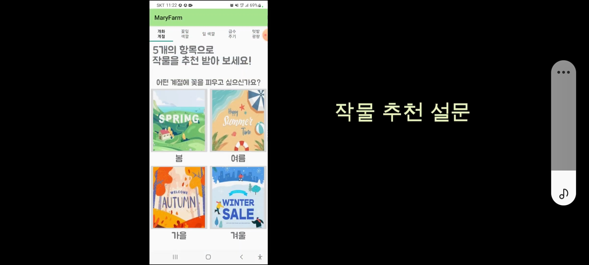

### 작물 별 쌓이는 재배 일지
- 날짜별 사진 및 기록들을 작물별로 기록하여, 해당 식물의 성장 기록을 쉽게 볼 수 있도록 지원

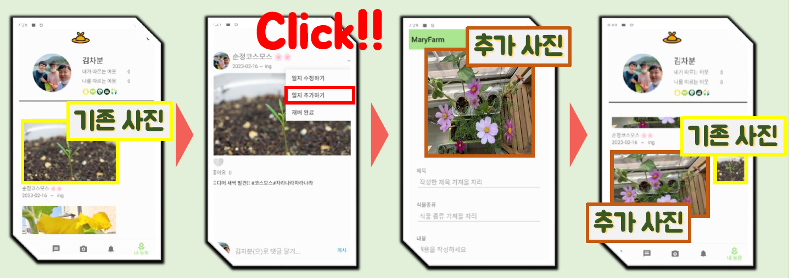
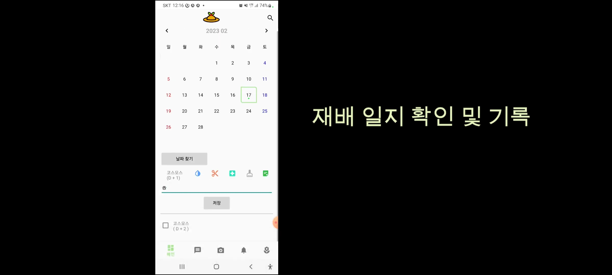

### 작물 생장을 위한 알림 제공
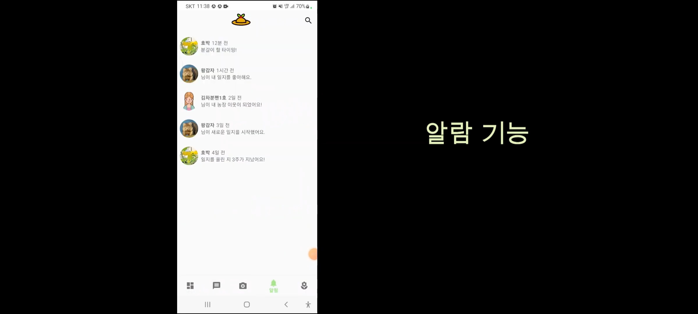

### 식집사들과의 소통 기능
 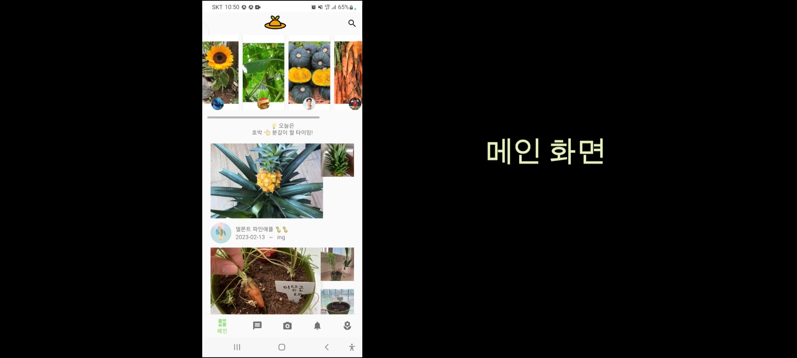 |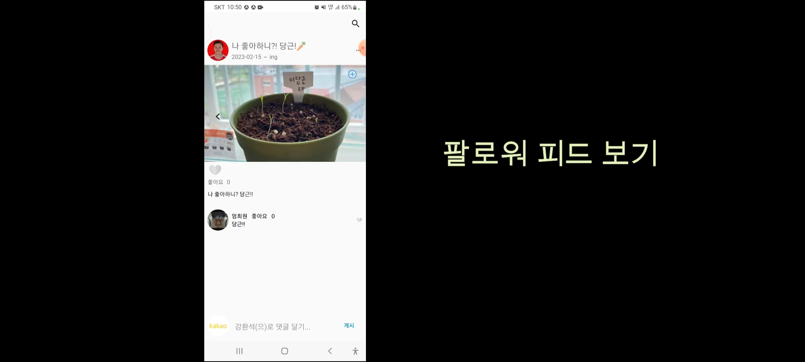
--- | --- | 
 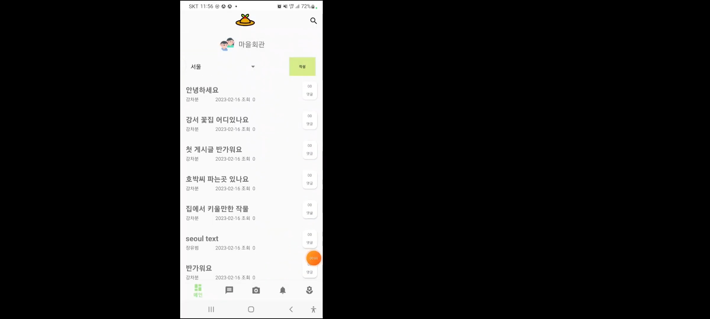 |

### 위젯 기능
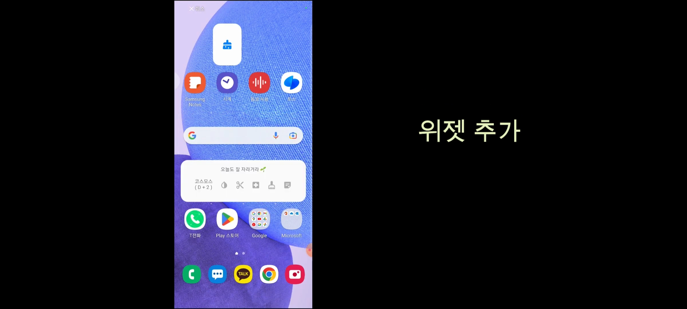

### 검색 기능
 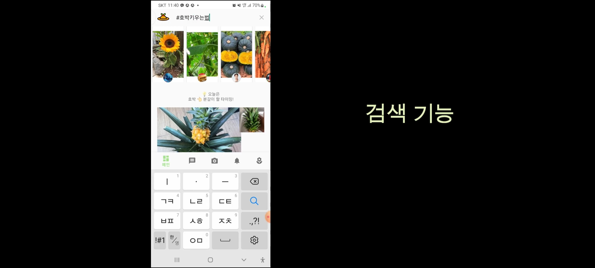 |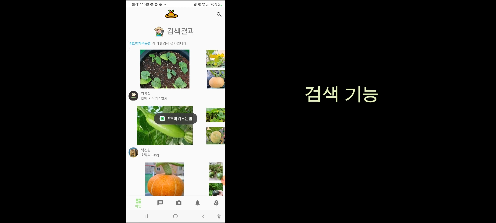
--- | --- | 

## 🔨Tech Stack
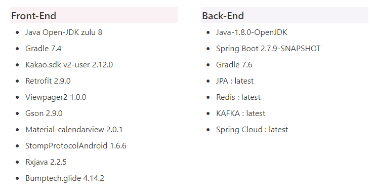
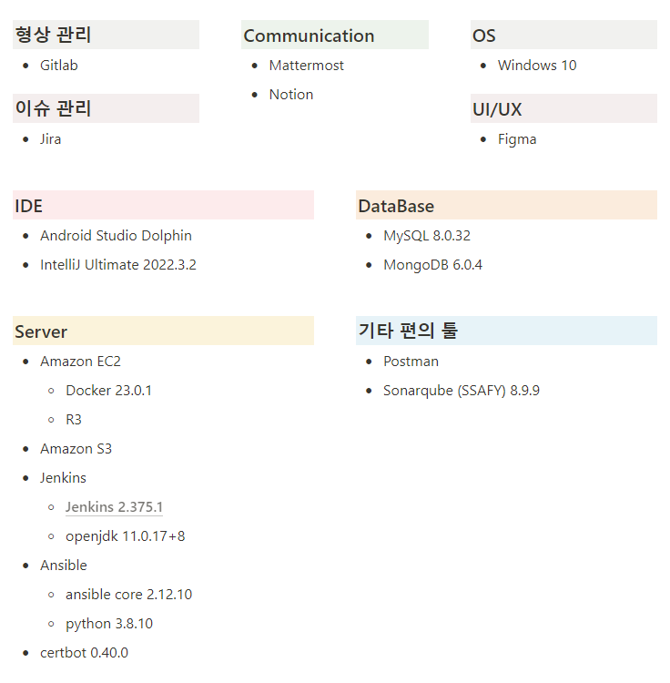

## Member & Role 👪
| 이름    | 담당 영역                                                        |
| ------ | ------------------------------------------------------------ |
| 강환석<br/>팀장 | - FrontEnd<br/>- 프로젝트 관리(바지 사장)<br/>- 영상 제작 및 발표자료 준비 |
| 장유범<br/>프론트앤드 장 | - FrontEnd<br/>- 앱 개발 |
| 김진희<br/>PM | - FrontEnd<br/>- 앱 개발<br/>- 프로젝트 문서화<br/>- 프로젝트 일정 관리 및 업무 조정 |
| 김관섭<br/>PE | - FrontEnd<br/>- 앱 개발<br/>- 산출물 발표<br/>- 발표자료 제작 |
| 김이삭<br/>백앤드 장 | - BackEnd <br/> - CD/CI 구축 및 배포|
| 백승범<br/>서버 장 | - BackEnd<br/>- API  <br/> - 소켓 기반 채팅창 구축|

## Project Info 📜
### 👒 마리팜 최종 산출물
- [마리팜 최종 산출물](https://www.notion.so/c55560fa2039443fb8a8c1ed515743b0)
### 📋 API 명세
- [ 마리팜 API 명세서 ](https://www.notion.so/API-609e8ceec3044dcfb5c6f835f22b741d)
### 🛰️ Swagger
- [ 마리팜 test용 Swagger ](https://maryfarm.shop/swagger-ui/index.html?urls.primaryName=maryfarm-calendar-service)

### 🔖 컨밴션
 - [Java Convention](https://www.notion.so/Java-Convention-c06f899ca87b46fd974a32a74a6e0cdd)
 - [Android Convention](https://www.notion.so/Android-Convention-4e3dbf8af2d34d8e85971d4c3be6dd36)
 - [명세 네이밍 규칙](https://www.notion.so/6b3aee9748bd410c90f5ec7156af4e0e)

### 📚 ERD
- [ 마리팜 ERD ](https://www.erdcloud.com/d/y5vxexZN8TByiWuGM)

### ✒️ 와이어 프레임
- [ 마리팜 와이어 프레임 ](https://www.figma.com/file/WPm9P8dUo68hshfjORAGPR/%EB%A7%88%EB%A6%AC%ED%8C%9C?t=UjCgmziXAdcRs0Xh-0)

### 🔧시스템 구조도
- [ 마리팜 시스템 아키텍처 ](https://www.notion.so/948b7d60922e46789aeeeff70ecb127b)

### 📆 JIRA
- [ 마리팜 JIRA ](https://ssafy.atlassian.net/jira/software/c/projects/S08P12B308/boards/1454/roadmap)

### 🚜시퀀스 다이어그램
- [Chat Diagram](https://www.notion.so/Chat-Diagram-c73c103c26df405fbb0b6cb9901e7744)
- [Login Diagram](https://www.notion.so/Login-Diagram-f0a75377f1f54f22b85a24c0de75af33)
- [Tag Search Diagram](https://www.notion.so/Diagram-bb973432457a4200812d364051d574b4?pvs=4)

### 🐳 배포
- [마리팜 배포 절차](https://www.notion.so/81823b0d9494461288f01c3031b3c08d?pvs=4)

### 📚 자료 조사 내역
- [마리팜 데이터 조사](https://www.notion.so/b397288648964e50be9b57c4616de556)

## 📓 Back INFO
### Monolithic

1. @RequestBody를 String으로 받으면 Json처리 안됨.
2. ResposneDTO에 Entity 들어가면 프록시 객체일 수도 있으므로 왠만하면 안넣는게 좋을듯함.
3. INNER JOIN, LEFT OUTER JOIN, RIGHT OUTER JOIN이 존재하고, 일대다 상태에서 INNER JOIN을 해도 문제없음. 데이터 중복은 LEFT JOIN에서 발생할 확률이 크므로 조심.
4. 일대다 상태에서 FETCH JOIN을 하면 무조건, 뻥튀기 문제가 발생하게 됨. 따라서 DISTINCT가 요구됨.
5. OneToOne에서 주인이 아닌 쪽은 LazyLoading이 동작하지 않는데, OneToMany에서 주인이 아닌 쪽에서는 제대로 동작함.
6. 연관관계 Entity를 가지고 있을 때 주인이라면 DB상에서 FK를 가지고 있는 꼴임. 근데, JPA상에서는 객체이므로 Lazy Loading을 하면 프록시 객체를 가지게 되는데, 해당 프록시 객체에서 Id는 Getter로 조회해도 프록시 초기화가 발생하지 않음. 당연하게 DB상에서는 FK를 가지고 있으니까 그러는 듯함.
7. 프론트에 넘겨줄 DTO에 프록시 객체가 껴있지 않도록 주의해야 함. 아니면 프록시 객체 출력 예외 발생함.
8. 양방향 연관관계시 프론트에 json으로 넘겨주려면 한쪽에 @JsonIgnore을 붙여줘야 함.
9. Hibernate5Module를 등록해주면 프록시 객체를 json으로 변환시 예외가 발생하지 않고, 초기화되지 않은 프록시 객체는 출력되지 않고, 초기화된 프록시 객체만 출력됨. 다만, 이렇게 Entity를 직접 노출시키는 것보다 DTO로 만들어주는게 더 바람직함.
10. DB에서 search 속도 최적화를 위해 사용되는 INDEX는 search를 원하는 특정 칼럼에 대해 INDEX만 생성하면 이후의 조회에 적용됨. INDEX 사용시 explain을 해서 INDEX를 타는지 확인해주는 게 좋음.
11. 로그인, 검색 부분에서 INDEX를 사용해주는 게 좋을 듯함.
12. Entity타입 Collection은 왠만하면 다대다 관계일 것이므로 중간에 다대다 전용 테이블을 설정하고, 값타입 Collection은 값타입을 Entity로 묶어서 따로 테이블로 만들어주는 게 좋음.
13. @EmbeddedId와 @MapsId의 조합으로 외래키1개+일반컬럼1개의 복합키를 만들 수 있음.
14. Entity의 속성값들은 전부 값타입으로 줘야 함.
15. mappedBy를 사용해 양방향 연관관계를 설정하는 이유는 다른 테이블과 join한 결과를 해당 Entity로 가져올 때 다른 테이블의 컬럼값들을 담아오기 위해서임. 그렇게 안하면 join한 테이블들의 컬럼값들을 가져올 수 없음.
16. 가져오는 Entity 내의 연관관계 Entity 내의 연관관계 Entity를 프록시 객체로 가져오지 않으려면 Fetch join을 하나의 쿼리안에 여러번 실행해서 해결할 수 있음.
17. 팔로우한 유저의 일지 중 가장 최신 날짜를 조회한다던가, 작물id로 조회된 일지들 중 가장 최신 날짜를 조회하는 쿼리문은 서브쿼리를 사용해줘야 함. 근데 jpql에서 서브쿼리 사용하는거 빡세서 querydsl공부하고 해야할거 같음.
18. repository의 save 메서드를 통해 반환되는 Entity는 연관관계 Entity들이 전부 진짜로 채워져서 나옴. find는 프록시 객체로 나오는 것과 다름.
19. entity의 dirty check를 통해 변경시키는 게 update 쿼리를 짜는것보다 간단할 듯함.

## MSA

1.  FeignClient에서 RequestDTO를 사용하려면 사용하려는 곳에서 요청하려는 곳의 RequestDTO의 클래스를 가지고 있어야 함. 예를 들어 Member에서 Order의 메서드를 FeignClient로 실행하려면 OrderRequestDTO를 가지고 있어야 함. 이는 실무에서 라이브러리를 공유함으로써 해결할 수 있음.
2.  Swagger API DOCS를 보면서 Postman으로 데이터를 보내주는 게 엄청 편함.
3.  FeignClient를 사용하는 곳은 Service, Controller 모두 가능할 듯함.
4.  MSA 구조를 택한 대신, JPA의 객체지향적 이점을 포기해야 함. 예전에는 Diary만 조회해도 안에 User를 값으로 가지고 있기 때문에 자동으로 Join 처리되서
    User데이터도 채워졌는데, MSA는 Diary와 User가 독립적으로 조회가 되므로, 연관관계 처리가 불가능해 SQL을 두번날려야 함. 따라서 DTO를 만들때도 UserDTO를 따로 가져와서
    DiaryDTO에 채워주는 방식을 사용해야함.
5.  DTO에 Entity의 enum 타입이 들어갈 때, String으로 처리해주는 게 좋을 듯 함. 그렇게 안하면, 해당 DTO를 필요로 하는 다른 MSA의 FeignClient 쪽에서 해당 enum 클래스를 가지고 있어야 함.
6.  Controller의 메서드 중 create, update는 response로 id만 넘겨주고 id를 넘겨받은 프론트에서 해당 id로 데이터를 다시 조회할 수 있도록 하는게 바람직함. search는 데이터가 들어있는 DTO를 반환해주는 게 바람직함.
7.  알람이나 태그파싱은 Controller말고 Service에서 해주는게 Controller가 깔끔해질 듯함.
8.  다른 MSA에서 가져와야 알 수 있는 DTO를 내부 값으로 가지는 DTO를 만들기 위해서는 다른 MSA에서 가져온 DTO를 생성자 매개변수로 가지는 DTO로 설계해주는 게 좋을 듯함. 그래야 FeignClient의 사용처를 Controller로 당길 수 있음.
9.  busrefresh 사용시, hikariCP 관련 문제 발생하면 아래의 내용을 추가함.
    ```
    spring:
      cloud:
        refresh:
          extra-refreshable: com.zaxxer.hikari.HikariDataSource
    ```
10. circuitbreaker는 에러가 자주 발생하는 부분에서만 사용하는 게 좋을 듯함.
11. 모니터링 기술로 zipkin, grafana를 사용함.
12. Zipkin을 추가적을 사용할 시, Command line is too long 에러가 뜨는데 이를 해결하기 위해 idea dir의 workspace.xml 파일의 PropertiesComponent 컴포넌트에 `"dynamic.classpath": "true"` 를 추가해줌.
13. config server를 제외한 나머지 service들에 zipkin과 sleuth 설정을 해줬음.
14. grafana를 사용하려는데, prometheus를 docker로 실행할 때, yml파일을 변경해줘야 하므로 까다로워서 micrometer 의존성만 config server를 제외한 나머지 service들에 추가해줌.
15. Zipkin을 사용하면 sql 로그가 콘솔에 찍히지 않음. 따라서 개발 과정에서 Zipkin을 사용하는 것보다 개발 다하고 모니터링으로 사용하는 게 좋을 듯함.
16. 카프카를 통한 CQRS 처리를 위해 Update 쿼리들은 다 message queue로 감. 근데 jpa에서 key 자동생성전략을 통해 DB에 저장되는 pk값을 설정할 수 있었는데, 카프카는 connector를 통해 topic에 들어온 값 그대로 db에 업데이트 해버리니까 key 자동생성전략을 못쓰고 null이 들어가버림. 이를 해결하기 위해 애초에 자바에서 쿼리를 날릴 때 id값을 난수로 채워주고 message queue에 보내버려야 함. 진짜 제대로 할려면 streams를 활용해 id 값에 난수를 넣어주는 stream처리를 해볼 수도 있겠음.
17. KAFKA를 사용하는 이유는 CQRS와 데이터 동기화를 위해서고, 실제로는 messeage queue에서 DB로 값을 넣기 전에 적합성 검사를 하고 넣어줘야 하지만, 여기서는 간단하게 connector로 바로 넣어줬음. kafka는 단순히 db에 데이터를 입력해주는 역할 뿐 아니라, MSA간에 서로의 Entity에 대한 Update 요청을 할 때 사용해주는 것도 있음.
18. 8083 port는 KafkaConnector가 사용중이라 변경해줘야 함.
19. 현재 토픽의 삭제 정책을 1분으로 해놔서 나중에 배포할 때 수정해줘야 함.
20. kafka에서 connector가 db에 저장할 때 id가 null값이라도 JPA가 애플리케이션 시작할 때 ddl로 만들어주는 테이블 설정때문에 자동난수 설정 가능할지도...??
21. Config server의 basedir은 사용자마다 달라질 수 있어서 조심해야함.
22. config -> discovery -> gateway -> notify -> user -> plant 순으로 실행해야 함.
23. MSA 배포과정에서 아래 오류가 발생할 수 있음.
    ```
      Error running MaryfarmUserServiceApplication. Command line is too long. Shorten the command line via JAR manifest or via a classpath file and rerun.
    ```
24. LocalDateTime.now()는 UTC 기준이므로 한국시간 -9임. 따라서 ZonedDateTime.now()를 대신 사용하고, Data JPA의 Auditing 기능도 UTC이므로, prePersist()를 대신 사용함.
25. LocalDateTime을 RequestBody로 받기 위해서는 RequestDTO에서 @DateTimeFormat()을 명시해줘야함.
26. FeignClient로는 상대 MSA에서 Query를 가져오기 위해서만 사용하고, 상대 MSA의 Command를 유도하고 싶다면, kafka topic에 값을 넣어서
    상대 MSA에서 listen할 수 있도록 해줘야함.
27. LocalDateTime을 String으로 직렬화하기 위해서는 Custom Serializer, Deserializer를 구현해줘야 함.

    ```
    public class LocalDateTimeDeserializer extends JsonDeserializer<LocalDateTime> {
        private static final DateTimeFormatter DATE_FORMAT = DateTimeFormatter.ofPattern("yyyy.MM.dd HH:mm");

        @Override
        public LocalDateTime deserialize(JsonParser jsonParser, DeserializationContext deserializationContext) throws IOException, JsonProcessingException {
            return LocalDateTime.parse(jsonParser.getText(), DATE_FORMAT);
        }
    }
    ```

    ```
    public class LocalDateTimeSerializer extends JsonSerializer<LocalDateTime> {
        private static final DateTimeFormatter DATE_FORMAT = DateTimeFormatter.ofPattern("yyyy.MM.dd HH:mm");
        @Override
        public void serialize(LocalDateTime value, JsonGenerator gen, SerializerProvider serializers) throws IOException {
            gen.writeString(value.format(DATE_FORMAT));
        }
    }
    ```

28. 현재 Event Driven Architecture가 적용된 부분은 Notify가 Follow, Diary 생성을 마킹임.
29. springboot 최신버전부터는 application-{profile}.yml의 분리는 `spring.config.use-legacy-processing=true` 를 붙여야 가능해짐.


## 🔍 주차별 진행 내역
### 1주차 진행 내역 (2023.01.10-2023.01.13)
- 프리퀄
  - [아이디어 회의](https://www.notion.so/01-06-cf5bbea7843649b7a36225c211c2127e)

- 데일리 스크럼
[1일차](https://www.notion.so/Day1-1a51f058e5c4401f91322aea05420c9a)
 | [2일차](https://www.notion.so/Day2-168446027b8f4a67845024b3e1edaa2e)
 | [3일차](https://www.notion.so/Day3-59f3481db7bb47d5857c2c853dd3188e)
 | [4일차](https://www.notion.so/Day4-0b832bd54e2d42b1bb3b6a405adeea54)

### 2주차 진행 내역 (2023.01.16-2023.01.20)
- 데일리 스크럼
[5일차](https://www.notion.so/Day5-03fb93f7c9144852b81a8ab043c1287a)
 | [6일차](https://www.notion.so/Day6-70d242cf739f49bfb4fcf8de47e424f9)
 | [7일차](https://www.notion.so/Day7-ff04f3ba68f24a66bfa8355c9eb37302)
 | [8일차](https://www.notion.so/Day8-8ec368f3c973417f8c1bb85c6ed7d7ac)
 | [9일차](https://www.notion.so/Day9-669bd6db87eb468a81b07340d3e92d67)

### 3주차 진행 내역 (2023.01.25-2023.01.27)
- 데일리 스크럼
[10일차](https://www.notion.so/Day10-f9b79e2ed926433f84c012c04d3bc573)
 | [11일차](https://www.notion.so/Day11-79f3306cc6804a3982e5daa11351701b)
 | [12일차](https://www.notion.so/Day12-ccb210ae36b64ecaa4e0c024932d8fda)

### 4주차 진행 내역 (2023.01.30-2023.02.03)
- 데일리 스크럼
[13일차](https://www.notion.so/Day13-48d52f98f42444a6a9fc290b7c312e17)
 | [14일차](https://www.notion.so/Day14-18014cfe4a4f43d0a3ff44cd85a35a35)
 | [15일차](https://www.notion.so/Day15-891fcd45779e4c9d8e1f2ca8e4ff1dac)
 | [16일차](https://www.notion.so/Day16-b47912d115c24ec7a7714a118cd82df5)
 | [17일차](https://www.notion.so/Day17-c81041e5064d4ce881b13a9d29d1cb20)

 ### 5주차 진행 내역 (2023.02.06-2023.02.10)
- 데일리 스크럼
[18일차](https://www.notion.so/Day18-91086355490e40bbbd0e2649599643e8)
 | [19일차](https://www.notion.so/Day19-275d85f238ab465384116f282794f796)
 | [20일차](https://www.notion.so/Day20-6a59140a6e4942fba36995dd442e3d9a)
 | [21일차](https://www.notion.so/Day21-4c812edd354141569a6d531358d61679)
 | [22일차](https://www.notion.so/Day22-6a7224affd544734b8e290f48324fbbd)

### 6주차 진행 내역 (2023.02.13-2023.02.17)
- 데일리 스크럼
[23일차](https://www.notion.so/Day23-42ee064468a246eeb11ce3f94ed5ca6c)
 | [24일차](https://www.notion.so/Day24-630624cd9ddf41e1ae2b85101137697a)
 | [25일차](https://www.notion.so/Day25-29abee70e7074e9d828c70bcb6cc9be3)
 | [26일차](https://www.notion.so/Day26-0d7cf05478f842cbb1be48744c886040)
 | [27일차](https://www.notion.so/Day27-f3be343e072246c58097b6ffe090c29f)

 ## 프로젝트 회고 🙌
| 이름    | 내용                                                        |
| ------ | ------------------------------------------------------------ |
| 🩳강환석 | 개발 능력에 대한 회고를 하게 되는 지난 두 달 간 이었습니다.<br>팀원분들께서 쌓아 올려주신 많은 부분들에 누가 되지 않도록 열심히 할 생각이었지만, 결국 민폐를 끼친 것 같아서 마음이 무겁습니다.<br>실패한 리더십이었지만, 성공한 팀원운이었다고 생각합니다.<br>이번 기회에는 제대로 기여를 하지 못했지만, 다시금 또 같이 일을 하고 싶은 좋은 분들과 인연을 쌓은 것 같아서 행복한 마음입니다.<br>안드로이드, 매력적인 플랫폼이군요… 다음 기회에는 제대로 공부해서 제가 좋아하는 취미 관련 앱을 하나 출시하고 싶은 마음입니다.<br>한번 체력이 무너지고, 한번 마음이 꺾여버리니, 스노우볼이 굴러가서 마지막까지 제대로 일을 못했다는 느낌이 많이 듭니다.<br>스스로의 부족함과 주위 분들의 따뜻하고 든든한 백업을 느낄 수 있었던 기회였던 것으로 생각하고 있습니다.<br>혼자서 API, 백앤드를 구축하신 승범님, 항상 분위기 메이킹을 위해 힘써주셔서 감사합니다… 오디오 비지 않게 항상 busy하신 모습, 멋지십니다!<br>대전 CI/CD의 최고 인재, 이삭님. 항상 유쾌하시고 유머 넘치는 행동으로 주위 사람들을 편안하게 해주셔서 감사합니다. 저희 팀의 기술력의 허리! 항상 감사합니다!<br>옷도, 쓰시는 물건들도 세련 그 자체인 멋쟁이!  자바 관련 문제가 생기면 호출당하시던 자바 천재 유범님… 마지막까지 코드 케어해주시고 버그 픽스해주시는 모습… 감사합니다!<br>우리 형님, 정신적 지주로서 항상 중심을 잡아주셔서 감사합니다. 스스로 깨닫지 못한 때에도 먼저 캐치하고 신경써주시고, 대전 제일의 인덕이시라 감히 확신하는 관섭 형님! 멋집니다!<br>그리고, 진희님… 고생은 진짜 고생대로 다 하시고, 마음고생, 몸고생하시면서 마지막날의 마지막 시간까지 계속 개발하고 코드를 작성해주시던 캐리어… 제가 어떻게든 죽지 않고 플젝을 끝낼 수 있었던 것은 업무 분담, 과업 체크, 기능 개발 등 대부분의 일을 직접 관리해주신 진희님 덕분일 겁니다… 사실상 팀장 그 자체… 감사합니다!<br>특화 프로젝트에서는 공통의 네 분이서 같이 진행하시기에 더욱 더 친밀한 상태에서 합이 잘 맞게 진행하실 수 있을 것 같습니다.<br>항상 건승을 기원드리며, 미미한 도움이지만, 제가 도울 일이 있으면 언제든 말씀주시길 부탁드리겠습니다.<br>이번 프로젝트를 통해 쌓았던 업보와 빚을 갚아 나아가는 바지 팀장이 되겠습니다.<br>세상에서 제일 멋진 우리 노인정 ver.1 팀원 분들. 진짜 진짜 고생하셨고, 진짜 진짜 감사했습니다! |
| 🧞김진희 | 생각지도 못했던 안드로이드 앱을 개발하게 되면서 매우 분주하고 정신없는 7주를 지나보냈네요.<br>안드로이드도, 자바도 다 낯설어서 잘 할 수 있을까 걱정됐는데 오히려 **뭐든지 할 수 있다!**는 마음가짐을 다질 수 있는 시간이 되었습니다.<br>새로운 IDE환경도 재미있고, 모바일 어플의 각 기능이 시시각각 만들어지는 것도 아주 재미있었습니다.<br>백지에서부터 시작하면서도 즐겁게 일할 수 있었던 건 아마 함께 실소하며 배워가는 팀원들이 있어서인 듯 합니다.<br>항상 네거티브 타임이라고 절 타박하면서도 말하는 대로 작업해준 노인정 회원님들.. 수고하셨고 감사합니다 😊<br>  개발 과정 중 마음에 남는 일들을 기록해보려고 해요 ㅎㅎ<br>개발 중간에 액션바를 도입해서 모든 액티비티를 프래그먼트로 바꾸게 해버린 것.. 돌이킬 수 있다면 우리의 하반기가 한층 윤택할 것 같기도 해요<br>상하단 메뉴를 좀 더 이해하고 연동성을 높일 수 있었다면 더 멋진 어플이 되었을텐데 하고 아쉽습니다.<br>캘린더를 라이브러리로 시작했는데 우리 어플의 주요 기능에 맞춰서 여러가지 커스텀 작업을 하다보니 역시 내가 직접 만들었으면 어땠을까 합니다.<br>UI에 관한 고민도 더 녹여내고 싶었는데 그걸 다 신경쓸만큼의 시간을 내지 못해서 크게 마음에 남네요.<br>막판에는 남은 부수 기능들을 최대한 구현하려고 위젯, 게시판, 알림 기능 등을 최소한으로 꾸려냈는데<br>다음 프로젝트에는 좀 더 적은 기능들을 고도화해서 구현하는 작업을 해보고자 합니다.<br>부족한 실력이었지만 좋은 앱개발 경험이었습니다. 코틀린과 스위프트도 재밌을 것 같아요. 먼 미래에… 다시 만날 수 있을까 안녕👋 |
| 🍊장유범 | - 프론트 팀원 모두 처음 해보는 안드로이드였지만 같이 강의도 구매하고 모르는 부분을 서로 물어보면서 재밌게 배울 수 있었고 백엔드 팀원분들도 안드로이드와 연결부분에서 웹과는 다른 부분이 많았을텐데 잘해주셔서 안드로이드 개발에 집중해서 진행 할 수 있었습니다. <br>깃과 지라 등 개념만 알고 있던 협업툴들에 대해서도 능력 있는 우리 팀원들 덕분에 프로젝트를 하면서 많은 걸 배운 시간이었고 이렇게 좋은 팀원들을 만나 첫 프로젝트를 진행할 수 있어 감사하고 행복했습니다. <br>앞으로도 우리 노인정 팀원분들 응원하고 잘 되길 기원하겠습니다. 화이팅입니다 !  ,  마리팜도 화이팅 = ) |
| 🐵김관섭 | 돌이켜보면 무슨 생각으로 ‘앱’을 도전했었나 싶기도 하지만, 대단한 용기였다고 생각합니다.<br>결과론적 관점에서 더 빠르게 배워 성과를 내지 못했다는 점에서 아쉬움이 많이 남는 것은 사실이지만,<br>그럴 때 마다 ‘익숙한 웹이 아닌, 앱 서비스를 선택한 이유’를 되새기고,<br>7주라는 시간동안 큰 문제 없이 서로 도와가며 함께했던 팀원분과의 추억만으로도 충분한 위로가 됩니다.<br>앞으로 살아가면서 무수히 많이 맞게될 세상의 억까 속에서 ‘버티는 것이 이기는 거다’ 전략으로 꾿꾿이 버텨봅시다~<br>그 동안 고생 너무 많으셨고, 여러분들의 빠른 싸탈을 기원합니다!!<br>  -  노인회장 김 관 섭👨‍🦳 & 마리팜 친구들 일동 🍊🍍🍏🍓🥦🥕🌸  - |
| 💎백승범 | 해당 프로젝트를 통해 처음으로 제대로 된 팀 프로젝트를 해봤습니다. 상대적으로<br>짧은 시간에 속하는 4주동안, 모바일 앱 개발을 목표로 열심히 달려 왔던 것 같습니다.<br>열정적으로 모바일을 배우시는 프론트 분들의 모습을 보여 바람직한 자세를 배웠고,<br>그에 상응하기 위해 저도 노력해서 많은 기술을 배울 수 있었습니다. 지금 이 경험이<br>저를 더 성장시켜주는 값진 밑거름이 되었다고 느낍니다. 지금까지 많이 고생들 하셨으며, <br>덕분에 감사했고, 저도 더 발전하는 백엔드 개발자가 되도록 최선을 다해 노력하겠습니다!|
| 🍞김이삭 |안녕하세요. 김이삭입니다.<br>벌써 프로젝트 마지막 날이 지났네요. 첫 주에 기획하면서 머리 싸맸던 기억이 어그제 같은데, 시간은 정말 빠르네요.<br>제가 데브옵스를 할 거라고 생각도 못했는데, 하면서 또 많이 배웠네요. 이번에 실제 아키텍처 디자인과는 조금 부족했지만 다음에는 더 고도화해서 좋은 결과를 냈으면 좋겠습니다.<br>실제로 다른 분들에게도 저희 팀 정말 좋다고 말 많이 하고 다녔습니다. 각자의 자리에서 닦달도 하고 성실하게 개발도 하고 일으켜 세워주는 곳이어서 좋았습니다.<br>물론 그만큼 제 역할이 부담스러웠고 열심히 임했습니다. 다들 노력하니 저도 노력하게 되더군요!<br>다들 고생하셨고 우리 팀 정말 좋았고 다음에도 본인들이 원하시는 일들 잘 이뤄가시길 바랍니다.<br>첫 발자국일 뿐입니다. 몇 번을 도전하다 보면 좋은 일들이 넘쳐날 것입니다! 화이팅! |

